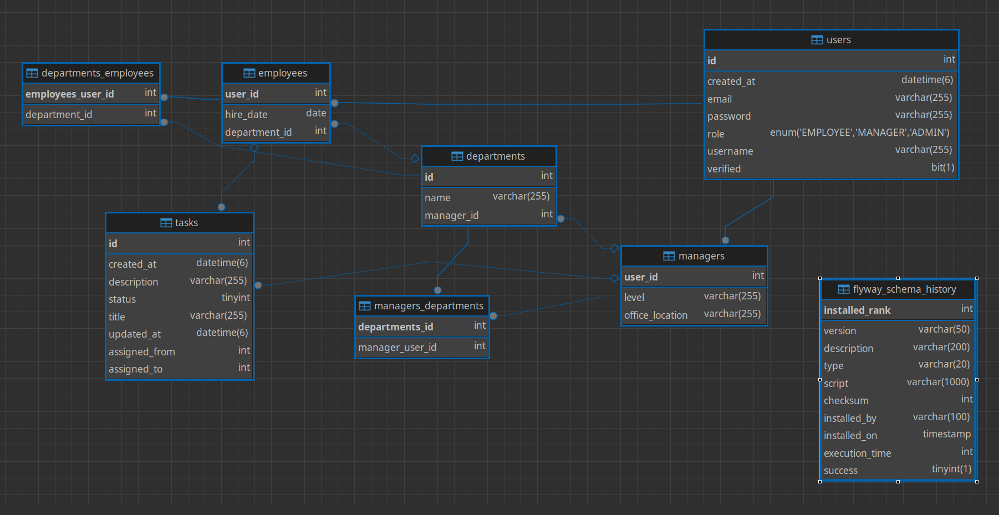

# Task Management System

A comprehensive task management system built with Spring Boot that provides functionality for managing tasks, users, departments, and notifications in an organizational setting.

## Features

- **User Management**: Support for Employees, Managers, and Admins with role-based access control
- **Department Management**: Organize employees into departments with manager assignments
- **Task Assignment**: Managers can assign tasks to employees with status tracking
- **Email Notifications**: Automated email notifications for task assignments and updates
- **JWT Authentication**: Secure authentication with JWT tokens
- **Scheduled Notifications**: Daily and weekly notification system for task reminders
- **Caching**: Redis-based caching for improved performance
- **Database Migration**: Flyway for database schema versioning
- **Message Queue**: Asynchronous processing of task updates, notifications, and OTP using RabbitMQ for reliable and scalable communication between services


## Technologies Used
[](#backend)

## Database Schema


### Core Framework
- **Spring Boot 3.5.4** - Main application framework
- **Java 21** - Programming language
- **Maven** - Dependency management and build tool

### Data Persistence
- **Spring Data JPA** - Object-relational mapping
- **MySQL 8.0** - Primary database
- **Flyway** - Database migration tool
- **Hibernate** - JPA implementation

### Security
- **Spring Security** - Authentication and authorization
- **JWT (JSON Web Tokens)** - Token-based authentication
- **JJWT 0.11.5** - JWT library for Java

### Caching & Performance
- **Redis 7.2** - In-memory data structure store for caching
- **Jedis** - Java Redis client

### Communication
- **Spring Boot Mail** - Email functionality
- **SMTP (Gmail)** - Email service provider

### Development & Utilities
- **Lombok** - Reduce boilerplate code
- **Spring Boot Actuator** - Application monitoring and management
- **Spring Boot Test** - Testing framework

### Infrastructure
- **Docker Compose** - Container orchestration for development environment

## Prerequisites

- Java 21 or higher
- Maven 3.6+
- MySQL 8.0
- Redis 7.2
- RabbitMQ 3.x (for message queuing)
- Docker and Docker Compose (optional, for containerized setup)

## Installation & Setup

### Option 1: Using Docker Compose (Recommended)

1. Clone the repository:
   ```bash
   $ git clone git@github.com:MohamedAEmara/task-management-system.git
   $ cd task-management-system
   ```

2. Start the required services (MySQL, Redis, and RabbitMQ):
   ```bash
   $ docker-compose -f src/main/resources/docker-compose.yml up -d
   ```
   
   > **Note**: This will start MySQL, Redis, and RabbitMQ containers. RabbitMQ Management UI will be available at http://localhost:15672 (admin/password)

3. Build and run the application:
   ```bash
   ./mvnw clean install
   ./mvnw spring-boot:run
   ```

### Option 2: Manual Setup

1. **Install MySQL 8.0** and create a database named `task-management-system`

2. **Install Redis 7.2** and ensure it's running on port 6379

3. **Configure Email Settings** in `application.properties`:
   - Update `spring.mail.username` and `spring.mail.password` with your Gmail credentials
   - Enable "App Passwords" in your Gmail account for authentication

4. **Build and run the application**:
   ```bash
   ./mvnw clean install
   ./mvnw spring-boot:run
   ```

## Configuration

### Database Configuration
```properties
spring.datasource.url=jdbc:mysql://localhost:3306/task-management-system
spring.datasource.username=emara
spring.datasource.password=asdfasdf
```

### Email Configuration
```properties
spring.mail.host=smtp.gmail.com
spring.mail.port=587
spring.mail.username=your-email@gmail.com
spring.mail.password=your-app-password
```

### Redis Configuration
```properties
spring.redis.host=localhost
spring.redis.port=6379
```

### JWT Configuration
```properties
jwt.secret=TnIyTCYMZ5CMF/Jh18fru6RZ9UXoe5C4qGw3uiJ3GUg=
jwt.expiration=3600000
```

### Notification Settings
```properties
notification.cron.daily=0 0 9 * * ?
notification.cron.weekly=0 0 10 * * MON
notification.enabled=true
```

### RabbitMQ Configuration
```properties
spring.rabbitmq.host=localhost
spring.rabbitmq.port=5672
spring.rabbitmq.username=admin
spring.rabbitmq.password=password
```
## API Endpoints

The application provides REST APIs for:

- **Authentication** (`/auth/*`) - Login, registration, account verification
- **Users** (`/users/*`) - User management
- **Departments** (`/departments/*`) - Department operations
- **Tasks** (`/tasks/*`) - Task management
- **Notifications** (`/notifications/*`) - Notification management

## Database Schema

The application uses the following main entities:

- **Users**: Base user information with role-based access (EMPLOYEE, MANAGER, ADMIN)
- **Managers**: Extended user information for managers
- **Employees**: Employee-specific information with department associations
- **Departments**: Organizational units managed by managers
- **Tasks**: Task entities with assignment and status tracking

## Scheduled Jobs

- **Daily Notifications**: Sent at 9:00 AM every day
- **Weekly Notifications**: Sent at 10:00 AM every Monday

## Development


### Building the Application
```bash
./mvnw clean package
```

### Running with Different Profiles
```bash
./mvnw spring-boot:run -Dspring-boot.run.profiles=dev
```

## Project Structure

```
src/
├── main/
│   ├── java/com/emara/task/
│   │   ├── config/          # Configuration classes
│   │   ├── controller/      # REST controllers
│   │   ├── dto/             # Data Transfer Objects
│   │   ├── model/           # Entity classes
│   │   ├── repo/            # Repository interfaces
│   │   ├── security/        # Security configuration
│   │   └── service/         # Business logic
│   └── resources/
│       ├── db/migration/    # Flyway migration scripts
│       └── application.properties
└── test/                    # Test classes
```

## Support

For support or questions, please contact the development team or create an issue in the repository.
